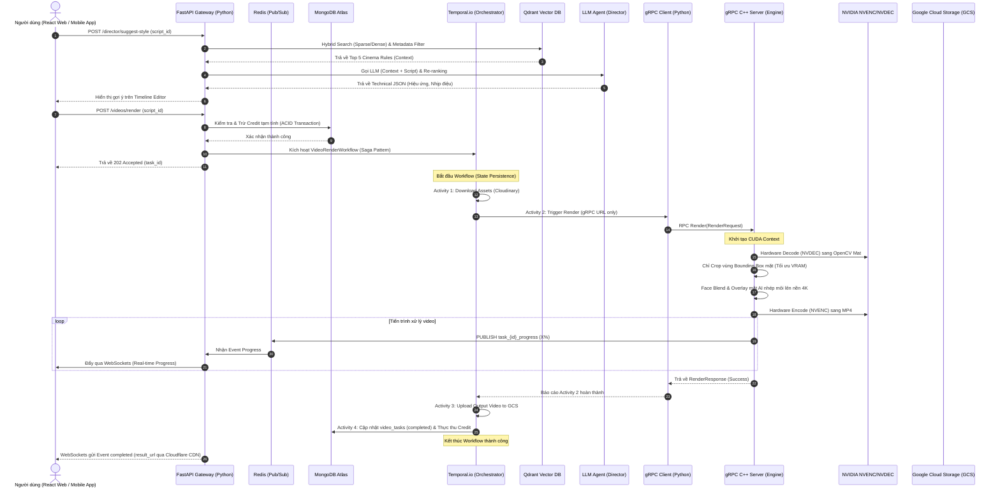

# ⬡ KLINK AI - NỀN TẢNG SINH VIDEO AI & MẠNG XÃ HỘI (FULLSTACK CORE)

[](https://cloud.google.com/)
[](https://www.docker.com/)
[](https://github.com/features/actions)
[](https://fastapi.tailwindcss.com/)
[](https://vitejs.dev/)
[](https://isocpp.org/)

**Klink AI** là nền tảng sinh video AI tự động kết hợp mạng xã hội quy mô lớn. Dự án được thiết kế theo mô hình phân tách hoàn toàn **Frontend** (Web Client & Mobile App) và **Backend** (Python FastAPI Gateway, gRPC C++ Core Engine, Temporal.io Orchestrator), được đóng gói và vận hành tự động trên đám mây Google Cloud.

---

## 🧠 Sơ Đồ Kiến Trúc Hệ Thống & Luồng Dữ Liệu

Kiến trúc tương tác giữa các phân hệ được thiết kế tối ưu hóa tốc độ xử lý video 4K bằng phần cứng chuyên biệt (GPU NVIDIA) và cách ly lỗi:



### Các Kỹ Thuật Tối Ưu Hiệu Năng Cốt Lõi:
1. **Pass-by-Reference (Truyền tham chiếu):** Không truyền mảng byte video thô qua mạng gRPC hay Temporal. Tất cả giao tiếp chỉ truyền URL hoặc đường dẫn file cục bộ.
2. **Bounding Box Face Crop:** Nhép môi AI (`Wav2Lip`) chỉ xử lý trên ô vuông khuôn mặt nhỏ (ví dụ 256x256), sau đó C++ dùng OpenCV blend trở lại nền 4K gốc. Tiết kiệm 90% tải GPU và giữ nguyên độ nét 4K của video.
3. **NVIDIA Hardware Acceleration:** Đẩy toàn bộ tác vụ decode/encode video sang chip chuyên dụng **NVENC/NVDEC** trên GPU, giải phóng 100% tài nguyên CPU.
4. **Saga Pattern (Temporal.io):** Quản lý luồng công việc dài hạn. Nếu node C++ bị crash giữa chừng, Temporal sẽ ghi nhớ trạng thái và tự động retry đúng bước lỗi thay vì chạy lại từ đầu.

---

## 🚀 Hạ Tầng Google Cloud & Quy Trình CI/CD (DevOps)

Hệ thống được thiết kế theo tiêu chuẩn DevOps tự động hóa hoàn toàn từ mã nguồn đến triển khai, đảm bảo tính sẵn sàng vận hành và bảo mật cao.

### 1. Kiến trúc Đám mây (GCP Architecture)
*   **Google Cloud Run**: 
    *   `fastapi-demo-project` (Backend): Chạy ứng dụng API Gateway Python FastAPI.
    *   `frontend-service` (Frontend): Chạy ứng dụng React + Vite thông qua web server Nginx siêu nhẹ.
*   **Google Artifact Registry**: Kho lưu trữ tập trung Docker Images tối ưu cho Backend và Frontend.
*   **VPC & Tường lửa nội bộ**: Hệ thống mạng VPC độc lập (`day13-vpc`) thiết lập chặn Egress mặc định (`deny-all-egress`) và chỉ mở luồng kết nối tới API Google an toàn để tránh rò rỉ dữ liệu.
*   **Identity & Access Management (IAM)**: 
    *   Áp dụng nguyên lý **Đặc quyền tối thiểu (Least Privilege)**. Tách biệt Robot build/deploy (`github-ci-sa`) và Robot chạy thực tế lúc runtime (`cloudrun-runtime-sa`).

### 2. Pipeline Tự động hóa CI/CD (GitHub Actions)
Pipeline được khai báo trong `.github/workflows/ci.yml` tự động kích hoạt khi có sự kiện `push` lên nhánh `main` hoặc `deploy`:

```text
[Code Push] ──> [1. Chạy Test Pytest & Mock MongoDB] ──> [2. Xác thực GCP bằng WIF (OIDC)]
                       │
                       └──> [3. Build & Push Docker Images (Backend & Frontend)]
                                   │
                                   └──> [4. Lấy URL API động & Inject vào Frontend]
                                               │
                                               └──> [5. Triển khai lên Google Cloud Run]
```

*   **Bộ nhớ đệm (Caching)**: Tối ưu hóa hiệu năng bằng cách lưu cache thư viện python (`pip`) và cache các layer của Docker Buildx (`gha`).
*   **Bảo mật WIF (Workload Identity Federation)**: Kết nối giữa GitHub và Google Cloud thông qua mã thông báo OIDC động tồn tại trong 1 giờ, loại bỏ hoàn toàn việc lưu khóa JSON tĩnh nguy hiểm.

### 3. Giám sát & Cảnh báo (Observability)
*   **Structured JSON Logging**: Log của API được định dạng cấu trúc JSON, tự động bọc Trace ID (`X-Cloud-Trace-Context`) để dễ dàng truy vết sự cố trên **Logs Explorer**.
*   **Cảnh báo Alerting (Email)**:
    *   **5xx Error Alert**: Báo động ngay lập tức nếu phát hiện bất kỳ lỗi hệ thống HTTP 5xx nào trong vòng 1 phút, đính kèm link Sổ tay cứu hộ (`docs/runbooks/alert_5xx.md`).
    *   **Latency Alert**: Báo động nếu độ trễ phân vị p95 vượt quá 2 giây liên tục trong 5 phút.
*   **Performance Dashboard**: Bảng điều khiển giám sát trực quan 2 thông số vàng: **Traffic (Request Count)** và **Latency (Độ trễ p95)**.

---

## 🌳 Cấu Trúc Thư Mục Dự Án (Domain-Driven Design)

```text
klink-platform/
├── .env                          # Biến môi trường local (đã cấu hình GCP & AWS)
├── .env.example                  # File cấu hình mẫu cho nhà phát triển
├── docker-compose.yml            # Khởi chạy MongoDB, Redis, Qdrant, Temporal
├── sst.config.ts                 # Cấu hình IaC (SST v3) khai báo hạ tầng Cloud Run & Alerting
│
├── backend/                      # ==========================================
│   │                             # PHÂN HỆ BACKEND (Python FastAPI & C++)
│   │                             # ==========================================
│   ├── cpp_engine/               # LÕI XỬ LÝ VIDEO BẰNG C++ (Core Engine GPU)
│   │   ├── CMakeLists.txt        # Cấu hình biên dịch C++ (CUDA, OpenCV, gRPC)
│   │   ├── proto/                # Định nghĩa cấu trúc gRPC Protobuf
│   │   └── app/                  # Source code C++ (.cpp)
│   │
│   ├── app/                      # HỆ THỐNG WEB API & ORCHESTRATOR (Python FastAPI)
│   │   ├── main.py               # API Gateway & Structured Logging Middleware
│   │   ├── config.py             # Cấu hình Global BaseSettings của ứng dụng
│   │   ├── auth/                 # Phân hệ Xác thực & Tài khoản (JWT, bcrypt)
│   │   ├── rag/                  # Phân hệ AI RAG Director (LangChain, Qdrant)
│   │   ├── temporal_worker/      # ĐIỀU PHỐI WORKFLOW (Temporal Worker)
│   │   └── grpc_clients/         # Client giao tiếp với cpp_engine qua gRPC
│   │
│   ├── tests/                    # Bộ kiểm thử tự động (Pytest)
│   └── requirements/             # Khai báo các thư viện Python (base.txt & dev.txt)
│
├── frontend-web/                 # ==========================================
│   │                             # PHÂN HỆ FRONTEND WEB (ReactJS + Vite)
│   │                             # ==========================================
│   ├── Dockerfile                # Đóng gói 2 giai đoạn (Multi-stage Node & Nginx)
│   ├── vite.config.js            # Cấu hình build system Vite
│   └── app/
│       ├── main.jsx              # Điểm khởi chạy React app
│       ├── App.jsx               # Cấu hình routing và layouts chính
│       ├── services/api.js       # Axios client nhận API URL động (VITE_API_URL)
│       └── store/                # Quản lý State toàn cục bằng Redux Toolkit
│
└── docs/                         # ==========================================
    ├── runbooks/                 # Sổ tay hướng dẫn xử lý sự cố (alert_5xx.md)
    ├── postmortems/              # Báo cáo phân tích sự cố (incident_5xx_crash.md)
    └── production_readiness.md   # Bảng checklist đánh giá sẵn sàng vận hành (PRR)
```

---

## 🛠️ Hướng Dẫn Cài Đặt Môi Trường (Local Setup)

### 1. Cài đặt C++ Engine Dependencies (NVIDIA SDK, OpenCV, gRPC)
*   **CUDA Toolkit:** Cài đặt CUDA Toolkit bản 12.x trở lên. Kiểm tra bằng lệnh `nvcc --version`.
*   **NVIDIA Video Codec SDK (NVENC/NVDEC):** Tải và cấu hình SDK từ trang chủ NVIDIA Developer.
*   **OpenCV CUDA Support:** Biên dịch OpenCV từ source code với flag `WITH_CUDA=ON`, `WITH_CUDNN=ON`.
*   **gRPC C++:** Cài đặt gRPC & Protobuf từ source code bằng CMake.

### 2. Cài đặt Python Backend Dependencies
Yêu cầu Python 3.11+. Khởi chạy môi trường ảo:
```bash
cd backend
python -m venv .venv
source .venv/bin/activate  # Hoặc .venv\Scripts\activate trên Windows
pip install -r requirements/base.txt -r requirements/dev.txt
```

### 3. Cài đặt Frontend Web Dependencies
Yêu cầu cài đặt **Node.js (v18+)** và **npm**:
```bash
cd frontend-web
npm install
```

---

## 🚀 Hướng Dẫn Chạy Dự Án (Startup Guide)

Khởi chạy toàn bộ hệ thống ở môi trường local theo thứ tự các bước sau:

### Bước 1: Khởi động các Service Hạ tầng (Docker)
```bash
docker-compose up -d mongodb redis qdrant temporal
```

### Bước 2: Setup Database & Tạo Indexes MongoDB
```bash
cd backend
python scripts/setup_indexes.py
```

### Bước 3: Biên dịch và Chạy gRPC C++ Engine Server (Port 50051)
```bash
cd backend/cpp_engine
mkdir build && cd build
cmake ..
make -j$(nproc)
./klink_cpp_engine
```

### Bước 4: Khởi chạy Temporal Worker (Python)
```bash
cd backend
python -m app.temporal_worker.worker
```

### Bước 5: Khởi chạy FastAPI Web API Gateway
```bash
cd backend
uvicorn app.main:app --host 127.0.0.1 --port 8000 --reload
```
Swagger UI sẽ khả dụng tại: `http://127.0.0.1:8000/docs`

### Bước 6: Khởi chạy Frontend Web (ReactJS / Vite)
```bash
cd frontend-web
npm run dev
```
Trình duyệt sẽ mở ứng dụng tại: `http://localhost:5173`

---

## 🏆 Tiêu Chuẩn Hoàn Thành (Definition of Done - DoD)
*   **Frontend-Web:** Timeline editor lưu trữ trạng thái scene hoàn toàn đồng bộ thông qua Redux Toolkit, tự động hiển thị thanh tiến trình render thông qua kết nối WebSocket với backend.
*   **C++ Engine:** Xử lý video 4K không rò rỉ bộ nhớ (Memory Leak), giải phóng CUDA Context đúng cách sau mỗi request.
*   **Temporal Saga:** Tự phục hồi trạng thái thành công khi node gRPC C++ Server đột ngột tắt và hồi phục lại.
*   **MongoDB:** Mọi giao dịch ví credit bắt buộc phải bọc trong MongoDB ACID Session (`start_transaction`) để đảm bảo tính nhất quán dữ liệu.