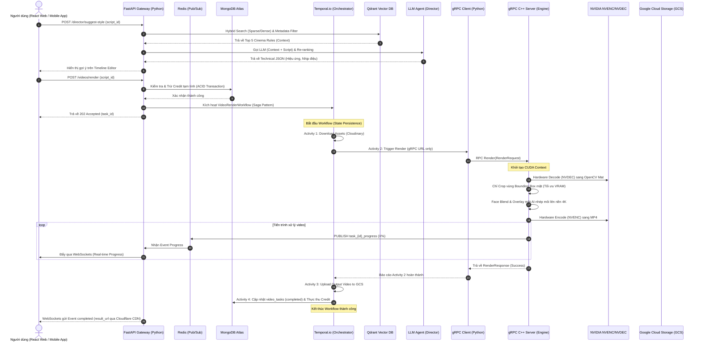

# ⬡ KLINK AI - NỀN TẢNG SINH VIDEO AI & MẠNG XÃ HỘI (FULLSTACK CORE)

Klink AI là một nền tảng sinh video AI tự động kết hợp mạng xã hội quy mô lớn. Dự án được phát triển theo mô hình phân tách hoàn toàn **Frontend** (Web Client & Mobile App) và **Backend** (Python FastAPI Gateway, gRPC C++ Core Engine, Temporal.io Orchestrator).

---

## 🧠 Sơ Đồ Kiến Trúc Hệ Thống & Luồng Dữ Liệu

Sự tương tác giữa các phân hệ được thiết kế tối ưu hóa tốc độ xử lý video 4K bằng phần cứng chuyên biệt và cách ly lỗi:



### Các Kỹ Thuật Tối Ưu Hiệu Năng Cốt Lõi:
1. **Pass-by-Reference (Truyền tham chiếu):** Không truyền mảng byte video thô qua mạng gRPC hay Temporal. Tất cả giao tiếp chỉ truyền URL hoặc đường dẫn file cục bộ.
2. **Bounding Box Face Crop:** Nhép môi AI (`Wav2Lip`) chỉ xử lý trên ô vuông khuôn mặt nhỏ (ví dụ 256x256), sau đó C++ dùng OpenCV blend trở lại nền 4K gốc. Tiết kiệm 90% tải GPU và giữ nguyên độ nét 4K của video.
3. **NVIDIA Hardware Acceleration:** Đẩy toàn bộ tác vụ decode/encode video sang chip chuyên dụng **NVENC/NVDEC** trên GPU, giải phóng 100% tài nguyên CPU.
4. **Saga Pattern (Temporal.io):** Quản lý luồng công việc dài hạn. Nếu node C++ bị crash giữa chừng, Temporal sẽ ghi nhớ trạng thái và tự động retry đúng bước lỗi thay vì chạy lại từ đầu, đảm bảo tính idempotent.

---

## 🌳 Cấu Trúc Thư Mục Dự Án (Fullstack Domain-Driven Design)

Mã nguồn được phân tách rạch ròi thành 3 cấu trúc chính: **Backend (Python & C++)**, **Frontend Web (ReactJS + Redux Toolkit)** và **Frontend Mobile (React Native + Expo)**.

```text
klink-platform/
├── .env                          # Biến môi trường local (chứa key nhạy cảm)
├── .env.example                  # File cấu hình mẫu cho nhà phát triển
├── docker-compose.yml            # Khởi chạy MongoDB, Redis, Qdrant, Temporal
│
├── backend/                      # ==========================================
│   │                             # PHÂN HỆ BACKEND (Python FastAPI & C++)
│   │                             # ==========================================
│   ├── cpp_engine/               # LÕI XỬ LÝ VIDEO BẰNG C++ (Core Engine GPU)
│   │   ├── CMakeLists.txt        # Cấu hình biên dịch C++ (CUDA, OpenCV, gRPC)
│   │   ├── proto/                # Định nghĩa cấu trúc gRPC Protobuf
│   │   │   └── video_service.proto
│   │   ├── include/              # Định nghĩa các Header files (.h / .hpp)
│   │   │   ├── face_blend.h      # OpenCV Seamless Clone & Bounding Box Face
│   │   │   ├── nvenc_wrapper.h   # Khai báo wrapper giao tiếp NVIDIA Video Codec
│   │   │   └── video_service_impl.h
│   │   └── app/                  # Source code C++ (.cpp)
│   │       ├── main.cpp          # Điểm khởi chạy gRPC Server (Port 50051)
│   │       ├── nvenc_wrapper.cpp # Tích hợp CUDA, giải mã & mã hóa GPU
│   │       ├── face_blend.cpp    # Thuật toán cắt cúp khuôn mặt và blend OpenCV
│   │       └── video_service_impl.cpp
│   │
│   ├── app/                      # HỆ THỐNG WEB API & ORCHESTRATOR (Python FastAPI)
│   │   ├── main.py               # Điểm khởi chạy FastAPI, cấu hình Middleware & Lifespan
│   │   ├── config.py             # Cấu hình Global BaseSettings của ứng dụng
│   │   ├── database.py           # Kết nối dùng chung (Motor Async Client, Qdrant Client)
│   │   │
│   │   ├── auth/                 # Phân hệ Xác thực & Tài khoản (JWT, bcrypt)
│   │   │   ├── router.py         # endpoints: /auth/signup, /auth/signin, /auth/signout, /auth/refresh
│   │   │   ├── schemas.py        # Pydantic Schemas
│   │   │   ├── models.py         # MongoDB Collection: `users`
│   │   │   ├── service.py        # Logic xử lý nghiệp vụ xác thực
│   │   │   ├── dependencies.py   # Inject get_current_user (JWT verification)
│   │   │   ├── config.py         # Auth-scoped Settings
│   │   │   └── ...
│   │   │
│   │   ├── users/                # Phân hệ Hồ sơ người dùng
│   │   │   ├── router.py         # endpoints: /users/{userId}, /users/me/profile
│   │   │   ├── schemas.py        # Pydantic: UserProfileUpdate
│   │   │   ├── models.py         # MongoDB Collections: `users`, `user_followers`
│   │   │   ├── service.py        # CRUD profile, đếm followers/following
│   │   │   └── ...
│   │   │
│   │   ├── assets/               # Phân hệ Quản lý File (Cloudinary / CDN uploads)
│   │   │   ├── router.py         # endpoints: GET /assets/upload-signature, POST /assets
│   │   │   ├── schemas.py        # Pydantic: CloudinarySignatureResponse, AssetCreate
│   │   │   ├── models.py         # MongoDB Collection: `assets`
│   │   │   └── ...
│   │   │
│   │   ├── scripts/              # Phân hệ Kịch bản Timeline Video
│   │   │   ├── router.py         # endpoints: POST /scripts/auto-generate, POST /scripts
│   │   │   ├── schemas.py        # Pydantic: ScriptCreate
│   │   │   ├── models.py         # MongoDB Collection: `scripts`
│   │   │   └── ...
│   │   │
│   │   ├── videos/               # Phân hệ Quản lý tác vụ render & trạng thái
│   │   │   ├── router.py         # endpoints: POST /videos/render, GET /videos/{taskId}/status, WS /ws/progress
│   │   │   ├── schemas.py        # Pydantic: RenderRequest, VideoStatusResponse
│   │   │   ├── models.py         # MongoDB Collection: `video_tasks`
│   │   │   └── ...
│   │   │
│   │   ├── social/               # Phân hệ Mạng xã hội (Feed, Post, Like, Comment)
│   │   │   ├── router.py         # endpoints: GET /feed, POST /posts, POST /posts/{id}/like
│   │   │   ├── schemas.py        # Pydantic: PostCreate, CommentCreate
│   │   │   ├── models.py         # MongoDB Collections: `posts`, `post_likes`, `post_comments`, `saved_posts`, `hashtags`, `post_hashtags`, `notifications`, `direct_messages`
│   │   │   └── ...
│   │   │
│   │   ├── billing/              # Phân hệ Thanh toán & Trừ Credit
│   │   │   ├── router.py         # endpoints: GET /billing/history, POST /billing/topup/stripe
│   │   │   ├── schemas.py        # Pydantic: TopupRequest
│   │   │   ├── models.py         # MongoDB Collection: `credit_logs`
│   │   │   └── ...
│   │   │
│   │   ├── admin/                # Phân hệ Dashboard Quản trị viên
│   │   │   ├── router.py         # endpoints: GET /admin/rag/knowledge-base, GET /admin/cluster/health
│   │   │   ├── schemas.py        # Pydantic: ClusterHealthResponse
│   │   │   ├── models.py         # Sử dụng tổng hợp báo cáo hệ thống
│   │   │   └── ...
│   │   │
│   │   ├── rag/                  # Phân hệ AI RAG Director (LangChain, Qdrant)
│   │   │   ├── router.py         # endpoints: POST /director/suggest-style, POST /rag/suggest-script
│   │   │   ├── schemas.py        # Pydantic: StyleSuggestionResponse
│   │   │   ├── models.py         # MongoDB Collections: `scraped_docs`, `rag_chunks`
│   │   │   └── ...
│   │   │
│   │   ├── temporal_worker/      # ĐIỀU PHỐI WORKFLOW (Temporal Worker)
│   │   │   ├── workflows.py      # VideoRenderWorkflow (Saga điều khiển luồng render)
│   │   │   ├── activities.py     # download_asset, trigger_cpp_engine, upload_to_cdn, charge_credit
│   │   │   ├── worker.py         # Script daemon khởi chạy worker lắng nghe Temporal queue
│   │   │   └── config.py
│   │   │
│   │   └── grpc_clients/         # Client giao tiếp với cpp_engine qua gRPC
│   │       ├── cpp_client.py
│   │       └── config.py
│   │
│   ├── core/                     # Các module cốt lõi dùng chung của Backend
│   │   ├── database.py
│   │   ├── exceptions.py
│   │   ├── models.py
│   │   └── security.py
│   │
│   ├── tests/                    # Thư mục chứa các bộ kiểm thử tự động
│   ├── requirements/             # Khai báo các thư viện Python
│   └── scripts/                  # Setup Indexes, Seed Data Admin
│
├── frontend-web/                 # ==========================================
│   │                             # PHÂN HỆ FRONTEND WEB (ReactJS + Vite)
│   │                             # ==========================================
│   ├── package.json              # Cấu hình dependency, thư viện (Redux, Axios, Socket.io)
│   ├── vite.config.js            # Cấu hình build system Vite
│   ├── index.html                # Điểm neo ứng dụng React (root)
│   └── app/
│       ├── main.jsx              # Điểm khởi chạy React app
│       ├── App.jsx               # Cấu hình routing và layouts chính
│       ├── index.css             # Design System CSS toàn cục (Tailwind/Vanilla)
│       │
│       ├── assets/               # CSS, static images, icons
│       ├── components/           # UI Components dùng chung (Button, Loading, Modal, VideoPlayer)
│       ├── context/              # Quản lý React Contexts (AuthContext, SocketContext progress)
│       ├── hooks/                # Custom React Hooks (useAuth, useWebSocket)
│       ├── layouts/              # Layout template (Sidebar, Header, MainContainer)
│       │
│       ├── pages/                # Các trang chính của hệ thống (chia theo domain nghiệp vụ)
│       │   ├── Auth/             # Trang Đăng nhập, Đăng ký, Đặt lại mật khẩu
│       │   ├── Dashboard/        # Trang quản lý cá nhân, danh sách assets
│       │   ├── Editor/           # Trang Timeline Video Editor (Kéo thả timeline, preview)
│       │   ├── Social/           # Trang Feed Video ngắn, Like, Comment, User profile
│       │   ├── Billing/          # Trang nạp credit, lịch sử ví credit qua Stripe
│       │   └── Admin/            # Dashboard giám sát tài nguyên server và cào RAG
│       │
│       ├── services/             # Call API Wrapper (Axios Client)
│       │   └── api.js            # Axios base instance (kèm auto inject JWT Bearer)
│       │
│       ├── store/                # Quản lý State toàn cục bằng Redux Toolkit
│       │   ├── index.js          # Redux Store Configuration
│       │   ├── timelineSlice.js  # State timeline video kéo thả (các scene, asset, audio)
│       │   └── userSlice.js      # State thông tin user, session, credit balance
│       │
│       └── utils/                # Helper functions, formatters
│
└── frontend-mobile/              # ==========================================
    │                             # PHÂN HỆ MOBILE APP (React Native / Expo)
    │                             # ==========================================
    ├── package.json              # Cấu hình dependencies mobile
    ├── app.json                  # Cấu hình dự án Expo (Splash screen, icons, permissions)
    ├── App.js                    # Điểm khởi chạy của Mobile App
    └── app/
        ├── components/           # Reusable Native UI components (Card, VideoFeedPlayer)
        ├── navigation/           # Cấu hình React Navigation (TabNavigator, StackNavigator)
        ├── screens/              # Màn hình Mobile (FeedScreen, ProfileScreen, EditorScreen, LoginScreen)
        ├── services/             # API client wrappers cho thiết bị di động
        └── store/                # Redux store đồng bộ cấu trúc với Web app
```

---

## 🛠️ Hướng Dẫn Cài Đặt Môi Trường

### 1. Cài đặt C++ Engine Dependencies (NVIDIA SDK, OpenCV, gRPC)
*   **CUDA Toolkit:** Cài đặt CUDA Toolkit bản 12.x trở lên. Kiểm tra bằng lệnh `nvcc --version`.
*   **NVIDIA Video Codec SDK (NVENC/NVDEC):** Tải và cấu hình SDK từ trang chủ NVIDIA Developer.
*   **OpenCV CUDA Support:** Biên dịch OpenCV từ source code với flag `WITH_CUDA=ON`, `WITH_CUDNN=ON`.
*   **gRPC C++:** Cài đặt gRPC & Protobuf từ source code bằng CMake.

### 2. Cài đặt Python Backend Dependencies
Yêu cầu Python 3.11+. Nên sử dụng môi trường ảo:
```bash
cd backend
python -m venv .venv
source .venv/bin/activate  # Hoặc .venv\Scripts\activate trên Windows
pip install -r requirements/base.txt -r requirements/dev.txt
```

### 3. Cài đặt Frontend Web & Mobile Dependencies
*   Yêu cầu cài đặt **Node.js (v18+)** và **npm** (hoặc **yarn** / **pnpm**).

#### Cài đặt Frontend Web:
```bash
cd frontend-web
npm install
```

#### Cài đặt Frontend Mobile:
```bash
cd frontend-mobile
npm install -g expo-cli
npm install
```

---

## 🚀 Hướng Dẫn Chạy Dự Án (Startup Guide)

Để khởi chạy toàn bộ hệ thống ở môi trường local, thực hiện theo thứ tự các bước sau:

### Bước 1: Khởi động các Service Hạ tầng (Docker Compose)
Khởi chạy MongoDB local (hoặc Atlas cloud), Redis, Qdrant và Temporal Server:
```bash
docker-compose up -d mongodb redis qdrant temporal
```

### Bước 2: Setup Database & Tạo Indexes MongoDB
Chạy script cấu hình các Index tối ưu hóa cho MongoDB:
```bash
cd backend
python scripts/setup_indexes.py
```

### Bước 3: Biên dịch và Chạy gRPC C++ Engine
```bash
cd backend/cpp_engine
mkdir build && cd build
cmake ..
make -j$(nproc)

# Khởi chạy gRPC C++ Engine Server (Port 50051)
./klink_cpp_engine
```

### Bước 4: Khởi chạy Temporal Worker (Python)
Worker này xử lý tác vụ render video dài hạn (Saga workflow):
```bash
cd backend
# Đảm bảo bạn đang kích hoạt .venv
python -m app.temporal_worker.worker
```

### Bước 5: Khởi chạy FastAPI Web API Gateway
```bash
cd backend
uvicorn app.main:app --host 127.0.0.1 --port 8000 --reload
```
Swagger UI sẽ khả dụng tại: `http://127.0.0.1:8000/docs`

### Bước 6: Khởi chạy Frontend Web (ReactJS / Vite)
```bash
cd frontend-web
npm run dev
```
Trình duyệt sẽ mở ứng dụng tại: `http://localhost:5173`

### Bước 7: Khởi chạy Frontend Mobile (Expo Simulator)
```bash
cd frontend-mobile
npx expo start
```
Quét mã QR bằng thiết bị Expo Go trên điện thoại iOS / Android của bạn để trải nghiệm.

---

## 🏆 Tiêu Chuẩn Hoàn Thành (Definition of Done - DoD)
*   **Frontend-Web:** Timeline editor lưu trữ trạng thái scene hoàn toàn đồng bộ thông qua Redux Toolkit, tự động hiển thị thanh tiến trình render thông qua kết nối WebSocket với backend.
*   **C++ Engine:** Xử lý video 4K không rò rỉ bộ nhớ (Memory Leak), giải phóng CUDA Context đúng cách sau mỗi request.
*   **Temporal Saga:** Tự phục hồi trạng thái thành công khi node gRPC C++ Server đột ngột tắt và hồi phục lại.
*   **MongoDB:** Mọi giao dịch tiền tệ/credit bắt buộc phải bọc trong MongoDB ACID Session (`start_transaction`) để đảm bảo không bị kẹt tiền.
# Klink_Repo

